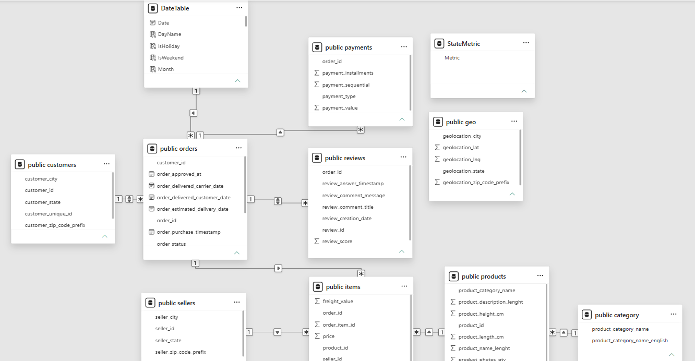

# Olist Insights: Brazilian E-Commerce Intelligence Dashboard

## Project Overview
Olist Insights is an end-to-end **Data Analytics and Business Intelligence** project built on the Brazilian Olist e-commerce dataset. The project integrates **SQL, Python, Power BI, and Machine Learning** to analyze over 100,000 marketplace orders, uncovering insights into sales performance, logistics efficiency, customer satisfaction, and review behavior.

The objective was to transform raw transactional data into actionable business insights and develop a predictive model to identify customers at risk of leaving negative reviews.

## Business Problem
Olist generates vast amounts of data across orders, customers, sellers, products, payments, logistics, and reviews. Key business questions addressed include:
- Which product categories and regions drive the majority of revenue?
- How efficient is the delivery network and what are the main bottlenecks?
- What factors influence customer satisfaction and review scores?
- Can negative reviews be predicted using operational and transactional data?

## Dataset
**Source**: [Olist Brazilian E-Commerce Dataset (Kaggle)](https://www.kaggle.com/datasets/olistbr/brazilian-ecommerce)

- **Time Period**: January 2016 – December 2018
- **Volume**: 100,000+ orders
- **Tables**: Orders, Customers, Sellers, Products, Reviews, Payments, Geolocation

**Raw Data**: `Olist/dataset/`  
**Cleaned Data**: `Olist/dataset/clean/`

## Technology Stack

| Category              | Tools                                      |
|-----------------------|--------------------------------------------|
| Database              | PostgreSQL                                 |
| Querying              | SQL                                        |
| Programming           | Python                                     |
| Data Processing       | Pandas, NumPy                              |
| Visualization         | Matplotlib, Power BI                       |
| Machine Learning      | Scikit-learn, XGBoost                      |
| Environment           | Jupyter Notebook                           |
| Version Control       | Git, GitHub                                |

## Detailed Project Workflow

### 1. Data Understanding
- Analyzed relationships across seven core tables.
- Mapped the complete customer journey from order placement to review submission.
- Understood order lifecycle, payment methods, and delivery processes.

### 2. Data Cleaning & Transformation
- Handled missing values, data type inconsistencies, and duplicate records.
- Performed date conversions and feature engineering.
- Created derived KPIs such as revenue, delivery days, and on-time delivery flags.
- Prepared analysis-ready datasets for SQL, Power BI, and ML modeling.

### 3. SQL Analysis
SQL was used extensively for data extraction, KPI generation, and business analysis.

Implemented:
- Multi-table JOINs across orders, customers, sellers, products, payments, and reviews
- Common Table Expressions (CTEs) for modular query design
- Window Functions (RANK, DENSE_RANK) for top-performing category and state analysis
- CASE statements for delivery and review segmentation
- Aggregations for revenue, order, and customer metrics
- Time-based analysis using date functions

SQL outputs were used to build analytical datasets, generate business KPIs, support dashboard development, and create machine learning features.

### 4. Exploratory Data Analysis (EDA)
Performed exploratory analysis to identify business trends, operational bottlenecks, and customer behavior patterns.

Key analyses included:
- Monthly revenue and order growth trends
- Category-wise revenue contribution analysis
- State-wise revenue and order distribution
- Delivery duration and late-order analysis
- Customer review score distribution
- Relationship between delivery performance and customer satisfaction
- Identification of top-performing products, categories, and regions

Insights from EDA directly guided dashboard design and machine learning feature selection.

### 5. Dashboard Development

#### Data Modeling (Star Schema)
Created a dimensional model in Power BI for optimal performance.  
The model was designed using a star-schema approach to improve query performance, filter propagation, and dashboard scalability.

**Fact Tables**: Orders, Reviews, Payments  
**Dimension Tables**: Customers, Sellers, Products, Geography, Date

DAX measures were created for Total Revenue, Total Orders, Total Customers, Average Review Score, On-Time Delivery %, Delivery Days, and Customer Experience KPIs.

**Model Relationship View**:

#### Business Intelligence Dashboards
The interactive Power BI dashboard follows a logical flow from high-level overview to granular insights.

### Home Dashboard
  
Serves as the landing page of the report and introduces the business problem, project scope, dashboard modules, and analysis objectives.

### Overview Dashboard
  
Provides a high-level business view through revenue, orders, customers, regional performance, and category analysis. Designed for executive-level monitoring of marketplace growth.

### Operations Dashboard
  
Tracks logistics performance, on-time delivery rate, average delivery days, late orders, and state-wise bottlenecks.

### Customer Experience & Predictive Analytics Dashboard
  
Analyzes review distribution, satisfaction metrics, rating patterns, and includes ML-powered dissatisfaction risk predictions.

## Machine Learning

### Objective
Predict the likelihood of a negative customer review (dissatisfaction risk) using only operational and transactional features available before the review is submitted.

### Model Comparison
| Model                | Recall | F1 Score | ROC-AUC |
|----------------------|--------|----------|---------|
| Logistic Regression  | 0.11   | 0.19     | 0.699   |
| Random Forest        | 0.28   | 0.39     | 0.726   |
| **XGBoost**          | **0.28** | **0.40** | **0.747** |

### Final Model Performance (XGBoost)
- **ROC-AUC**: 74.7%
- **F1 Score**: 0.40
- **Recall**: 28%

XGBoost was selected as the final model due to its superior ranking performance and overall classification capability compared to Logistic Regression and Random Forest.

### Limitations
The model uses only operational and transactional features available before a review is submitted. Customer dissatisfaction is also influenced by factors such as product quality, packaging condition, seller communication, customer expectations, review text, and product images, which are not available in the dataset. As a result, the model achieves a good ranking performance (ROC-AUC 74.7%) but lower recall (28%) when identifying dissatisfied customers.

## Dashboard Demo
A complete walkthrough of the dashboard is available in:  
`notebooks/img/dashboard_demo.mp4`

## Business Impact
- Enables data-driven monitoring of marketplace growth and operational efficiency.
- Supports early detection of at-risk customers for proactive retention.
- Highlights high-performing categories and regions for strategic focus.
- Provides actionable insights for improving delivery performance and customer experience.

## Key Findings
- Health & Beauty category generated the highest revenue.
- Top 10 categories contribute ~72% of total revenue.
- São Paulo is the highest contributing state.
- 96% of orders were successfully delivered with average delivery time ~12 days.
- 58% of reviews are 5-star while low-rated reviews are ~15%.
- Delivery performance strongly influences customer satisfaction.

## Future Improvements
- Incorporate review text sentiment analysis (NLP).
- Add SHAP values for better model interpretability.
- Include seller performance history and customer lifetime features.
- Improve model recall with richer feature engineering.
- Deploy dashboard on Power BI Service for live access.

## Final Business Conclusions
Olist demonstrates strong marketplace performance with high delivery success and predominantly positive customer feedback. However, revenue concentration and delivery inefficiencies present clear opportunities for optimization. The predictive model provides a solid foundation for proactive customer experience management.

## Author
**Rutuja**  
Computer Engineering Student  

**Core Skills:** SQL, PostgreSQL, Python, Power BI, Data Modeling, DAX, Data Visualization, Business Intelligence, Machine Learning, XGBoost

**Skills Demonstrated:** SQL, PostgreSQL, Data Cleaning, Data Transformation, Exploratory Data Analysis (EDA), Data Modeling, DAX, Power BI, Data Visualization, Machine Learning, XGBoost, Business Intelligence, Predictive Analytics.