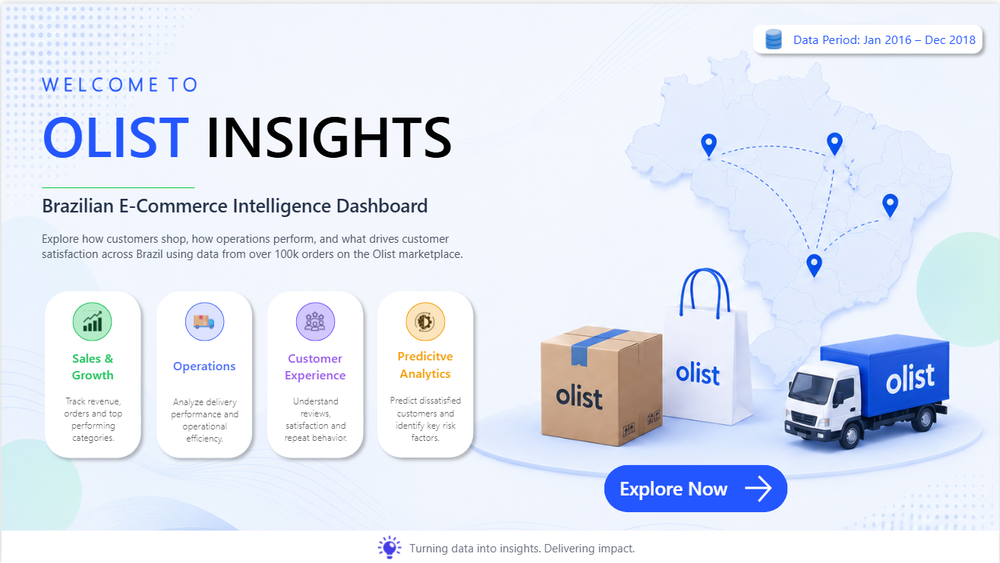
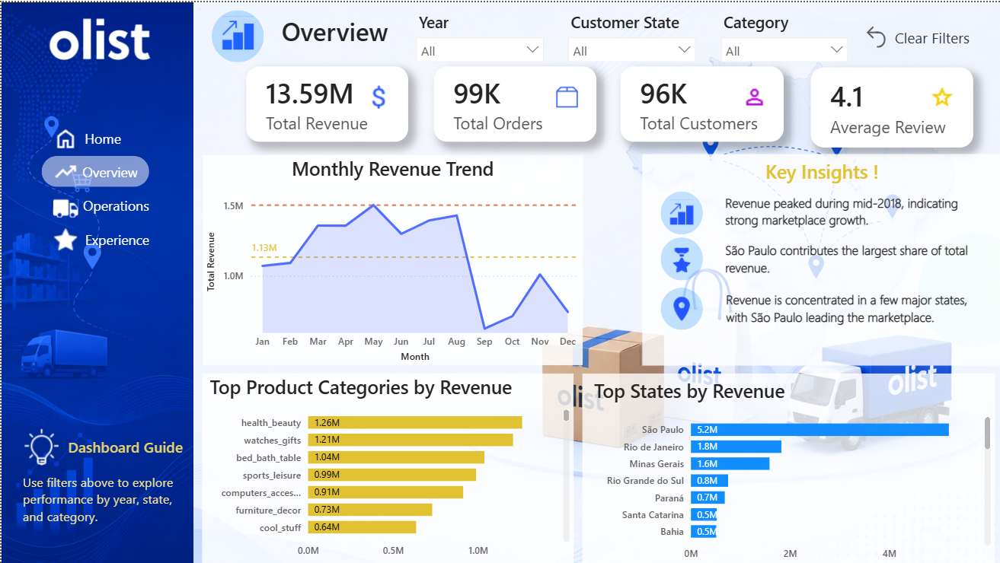
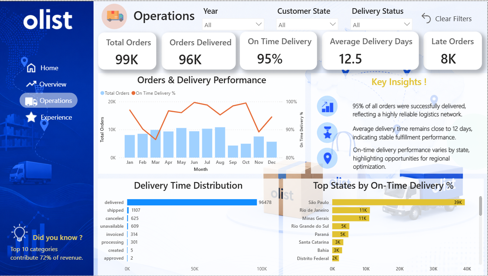
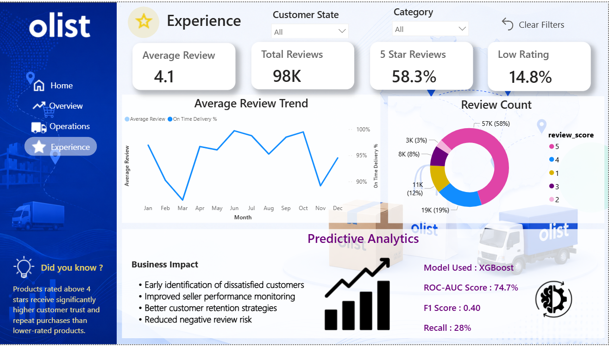

# Olist Insights: Brazilian E-Commerce Intelligence Dashboard

## Project Overview

Olist Insights is an end-to-end Business Intelligence and Predictive Analytics project built using the Brazilian Olist E-Commerce dataset.

The project combines Data Cleaning, SQL Analysis, Exploratory Data Analysis (EDA), Machine Learning, and Interactive Power BI Dashboards to transform raw marketplace data into actionable business insights.

The dashboard enables stakeholders to analyze sales performance, operational efficiency, customer experience, and review prediction outcomes across multiple business dimensions such as time, state, category, and delivery performance.

---

## Objectives

- Analyze revenue, orders, customers, and product category performance.
- Monitor logistics and delivery efficiency.
- Understand customer review behavior and satisfaction patterns.
- Predict the likelihood of negative customer reviews using Machine Learning.
- Provide decision-support insights through an interactive Power BI dashboard.

---

## Dataset

**Source:** Olist Brazilian E-Commerce Dataset

Kaggle Dataset:
https://www.kaggle.com/datasets/olistbr/brazilian-ecommerce

### Data Coverage
- Jan 2016 – Dec 2018
- 100K+ Orders
- Multiple business entities:
  - Customers
  - Orders
  - Payments
  - Products
  - Sellers
  - Items
  - Reviews
  - Geolocation
  - Category

### Project Data Structure

- Raw datasets stored in:
  ```
  Olist/dataset/
  ```

- Cleaned and transformed datasets stored in:
  ```
  Olist/dataset/clean/
  ```

---

# Technology Stack

### Data Processing
- Python
- Pandas
- NumPy

### Database
- PostgreSQL
- SQL

### Data Visualization
- Power BI

### Machine Learning
- Scikit-Learn
- XGBoost

### Development Environment
- Jupyter Notebook

---

# Project Workflow

### 1. Data Cleaning & Preparation

- Loaded and validated multiple Olist tables.
- Removed inconsistencies and handled missing values.
- Standardized data types and date formats.
- Created analytical datasets for dashboarding and ML modeling.

### 2. Exploratory Data Analysis

- Revenue trend analysis
- Order volume analysis
- Product category performance
- State-wise marketplace analysis
- Customer review exploration
- Delivery performance evaluation

### 3. Dashboard Development

Built a multi-page Power BI dashboard covering:

- Business Overview
- Operations & Logistics
- Customer Experience & Reviews
- Predictive Analytics

### 4. Machine Learning

Developed a review-risk prediction model to identify customers likely to leave low ratings.

Models evaluated:

- Logistic Regression
- Random Forest
- XGBoost

Final model selected:

**XGBoost**

---

# Dashboard Pages

---

## Landing Page

Provides project introduction, scope, dataset coverage, and navigation across dashboard modules.



---

## Overview Dashboard

The Overview page provides a high-level business summary of marketplace performance.

### Key Metrics

- Total Revenue
- Total Orders
- Total Customers
- Average Review Score

### Business Analysis

- Monthly Revenue Trend
- Top Product Categories by Revenue
- Top States by Revenue

### Insights Generated

- Revenue growth patterns across time.
- Best-performing product categories.
- Highest contributing states.
- Marketplace sales concentration analysis.



---

## Operations Dashboard

The Operations dashboard focuses on logistics performance and order fulfillment efficiency.

### Key Metrics

- Total Orders
- Orders Delivered
- On-Time Delivery %
- Average Delivery Days
- Late Orders

### Operational Analysis

- Orders vs On-Time Delivery Trend
- Delivery Status Distribution
- State-wise Delivery Performance

### Business Insights

- Identifies regions with strong delivery performance.
- Highlights delivery bottlenecks.
- Measures logistics efficiency across time.
- Tracks fulfillment consistency.

### Impact

Provides operational visibility for improving customer experience through better delivery performance.



---

## Experience & Predictive Analytics Dashboard

This page combines customer satisfaction analysis with machine learning-driven review prediction.

### Customer Experience Metrics

- Average Review Score
- Total Reviews
- 5-Star Review Percentage
- Low Rating Percentage

### Customer Review Analysis

- Review Trend Over Time
- Rating Distribution (1–5 Stars)

### Predictive Analytics

A binary classification model was developed to predict negative customer review risk using operational and transaction-related features.

### Final Model Performance

| Metric | Score |
|----------|----------|
| Model | XGBoost |
| ROC-AUC | 74.7% |
| F1 Score | 0.40 |
| Recall | 28% |

### Business Value

- Early identification of dissatisfied customers.
- Better customer retention planning.
- Improved seller performance monitoring.
- Reduction of negative review risk.
- Data-driven decision making for customer experience teams.

### Key Finding

More than half of all customer reviews were rated 5 stars, indicating generally strong customer satisfaction across the marketplace.



---

# Machine Learning Summary

### Problem Statement

Predict whether an order is likely to receive a poor customer review.

### Models Compared

| Model | ROC-AUC |
|---------|---------|
| Logistic Regression | 0.699 |
| Random Forest | 0.726 |
| XGBoost | 0.747 |

### Final Selection

XGBoost achieved the highest ROC-AUC score and was selected as the final model.

### Why This Matters

The model enables proactive identification of potentially dissatisfied customers before reviews are submitted, helping businesses improve customer experience and reduce churn risk.

---

# Key Outcomes

- Built an end-to-end Business Intelligence solution.
- Processed and analyzed 100K+ e-commerce transactions.
- Created interactive Power BI dashboards for business stakeholders.
- Performed customer review analytics.
- Developed and evaluated predictive machine learning models.
- Generated actionable insights across sales, operations, and customer experience.

---

## Author

**Rutuja**

Computer Engineering Student  
Data Analytics | Business Intelligence | Machine Learning
